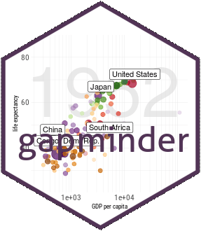
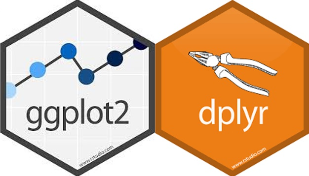

```{R, setup, include = F}
knitr::opts_chunk$set(echo = FALSE)
options(htmltools.dir.version = FALSE)
library(pacman)
p_load(
  broom, here, tidyverse,  latex2exp, ggplot2, ggthemes, viridis, extrafont, gridExtra,
  kableExtra,
  data.table,
  dplyr,
  lubridate,
  magrittr, knitr, parallel
)
# Define pink color
red_pink <- "#e64173"
turquoise <- "#20B2AA"
grey_light <- "grey70"
grey_mid <- "grey50"
grey_dark <- "grey20"
# Dark slate grey: #e64173
# Knitr options
opts_chunk$set(
  comment = "#>",
  fig.align = "center",
  fig.height = 7,
  fig.width = 10.5,
  warning = F,
  message = F
)
opts_chunk$set(dev = "svg")
options(device = function(file, width, height) {
  svg(tempfile(), width = width, height = height)
})
# A blank theme for ggplot
theme_empty <- theme_bw() + theme(
  line = element_blank(),
  rect = element_blank(),
  strip.text = element_blank(),
  axis.text = element_blank(),
  plot.title = element_blank(),
  axis.title = element_blank(),
  plot.margin = structure(c(0, 0, -0.5, -1), unit = "lines", valid.unit = 3L, class = "unit"),
  legend.position = "none"
)
theme_simple <- theme_bw() + theme(
  line = element_blank(),
  panel.grid = element_blank(),
  rect = element_blank(),
  strip.text = element_blank(),
  axis.text.x = element_text(size = 18, family = "STIXGeneral"),
  axis.text.y = element_blank(),
  axis.ticks = element_blank(),
  plot.title = element_blank(),
  axis.title = element_blank(),
  # plot.margin = structure(c(0, 0, -1, -1), unit = "lines", valid.unit = 3L, class = "unit"),
  legend.position = "none"
)
theme_axes_math <- theme_void() + theme(
  text = element_text(family = "MathJax_Math"),
  axis.title = element_text(size = 22),
  axis.title.x = element_text(hjust = .95, margin = margin(0.15, 0, 0, 0, unit = "lines")),
  axis.title.y = element_text(vjust = .95, margin = margin(0, 0.15, 0, 0, unit = "lines")),
  axis.line = element_line(
    color = "grey70",
    size = 0.25,
    arrow = arrow(angle = 30, length = unit(0.15, "inches")
  )),
  plot.margin = structure(c(1, 0, 1, 0), unit = "lines", valid.unit = 3L, class = "unit"),
  legend.position = "none"
)
theme_axes_serif <- theme_void() + theme(
  text = element_text(family = "MathJax_Main"),
  axis.title = element_text(size = 22),
  axis.title.x = element_text(hjust = .95, margin = margin(0.15, 0, 0, 0, unit = "lines")),
  axis.title.y = element_text(vjust = .95, margin = margin(0, 0.15, 0, 0, unit = "lines")),
  axis.line = element_line(
    color = "grey70",
    size = 0.25,
    arrow = arrow(angle = 30, length = unit(0.15, "inches")
  )),
  plot.margin = structure(c(1, 0, 1, 0), unit = "lines", valid.unit = 3L, class = "unit"),
  legend.position = "none"
)
theme_axes <- theme_void() + theme(
  text = element_text(family = "Fira Sans Book"),
  axis.title = element_text(size = 18),
  axis.title.x = element_text(hjust = .95, margin = margin(0.15, 0, 0, 0, unit = "lines")),
  axis.title.y = element_text(vjust = .95, margin = margin(0, 0.15, 0, 0, unit = "lines")),
  axis.line = element_line(
    color = grey_light,
    size = 0.25,
    arrow = arrow(angle = 30, length = unit(0.15, "inches")
  )),
  plot.margin = structure(c(1, 0, 1, 0), unit = "lines", valid.unit = 3L, class = "unit"),
  legend.position = "none"
)
theme_set(theme_gray(base_size = 20))
```
---

```{r,eval=FALSE,message=FALSE,warning=FALSE,echo=TRUE}

data(cars)
cars
hist(cars$speed)
hist(cars$dist)
attach(cars)
View(cars)
hist(speed)
speed
plot(cars, xlab="speed", y="stopping distance")
plot(cars, xlab="speed", y="stopping distance", title(main = "cars data"))

plot(cars, xlab="speed", y="stopping distance", title(main = "cars data"),
     pch=1)
plot(cars, xlab="speed", y="stopping distance", title(main = "cars data"),
     pch=1, col="red")

plot(cars, xlab="speed", y="stopping distance", title(main = "cars data"),
     pch=1, col="red", xlim=c(0,30), ylim=c(0,150))
lines(lowess(cars$speed, cars$dist), col = "blue")
barplot(cars$speed)
?plot
line(cars$speed)

```

---

# Багц

.pull-left[
```{r,eval=FALSE,echo=TRUE}
#ggplot2
install.packages("ggplot2")
library(ggplot2)

install.packages("gapminder")
library(gapminder)
?gapminder

#dplyr
install.packages("dplyr")
library(dplyr)
```
]

.pull-right[


]

---
# Ggplot2 example

.left-column[
```{r,warning=FALSE,echo=TRUE,eval=FALSE}
library(ggplot2)
library(gapminder)

summary(
  gapminder)

mean(gapminder
     $gdpPercap)

```
]

.right-column[
```{r}
library(ggplot2)
library(gapminder)

summary(gapminder)
mean(gapminder
     $gdpPercap)
```
]

---
# Mongolia

.pull-left[

```{r,echo=TRUE,eval=FALSE}
gapminder %>%
  filter(country=="Mongolia") %>%
  ggplot(aes(x=gdpPercap, y=lifeExp,
             col=year))+
  geom_point(alpha=0.99)
```

```{r,echo=TRUE,eval=FALSE}
gapminder %>%
  filter(country=="Mongolia") %>%
  ggplot(aes(x=gdpPercap, y=pop, 
             col=lifeExp))+
  geom_point(alpha=0.99)

```
]

.pull-right[
```{r}
gapminder %>%
  filter(country=="Mongolia") %>%
  ggplot(aes(x=gdpPercap, y=lifeExp, col=year))+
  geom_point(alpha=0.99)

gapminder %>%
  filter(country=="Mongolia") %>%
  ggplot(aes(x=gdpPercap, y=pop, col=lifeExp))+
  geom_point(alpha=0.99)

```

]
---
# Улсуудын жишээ

```{r,echo=TRUE,eval=FALSE}
gapminder %>% filter(gdpPercap<50000) %>% 
  ggplot(aes(x=gdpPercap,y=lifeExp,col=continent))+geom_point()
```

```{r,fig.align="center"}
gapminder %>%
  filter(gdpPercap<50000) %>%
  ggplot(aes(x=gdpPercap, y=lifeExp, col=continent))+
  geom_point()
```


---
# Улсуудын жишээ

.pull-left[
```{r plot-label, eval=FALSE,echo=TRUE}
gapminder %>% 
  filter(gdpPercap<50000) %>% 
  ggplot(aes(x=gdpPercap,y=lifeExp,
             col=continent))+geom_point()
```
]

.pull-right[
```{r plot-label-out, ref.label="plot-label", echo=FALSE, fig.dim=c(4.8, 4.5), out.width="100%"}
```
]
