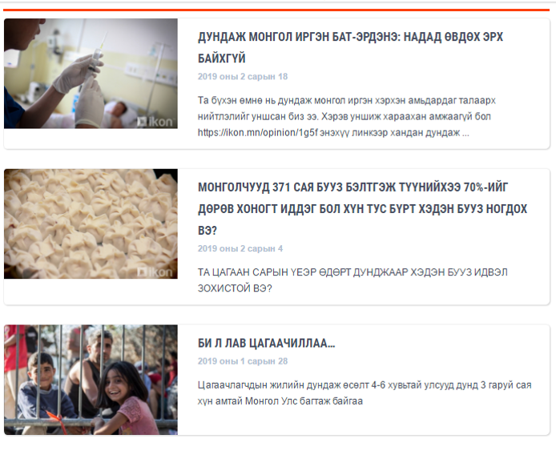
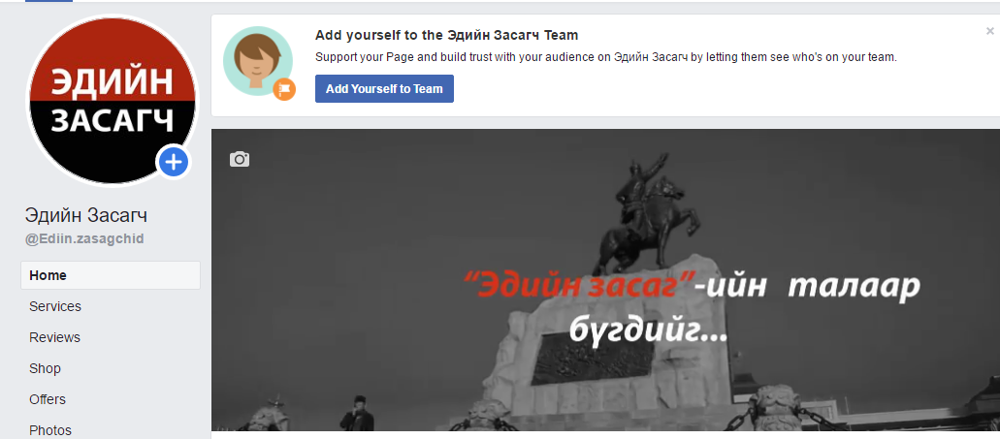
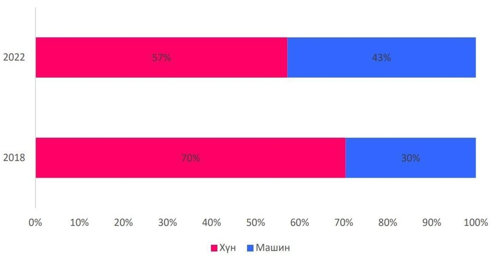
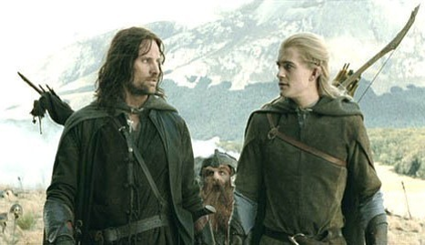
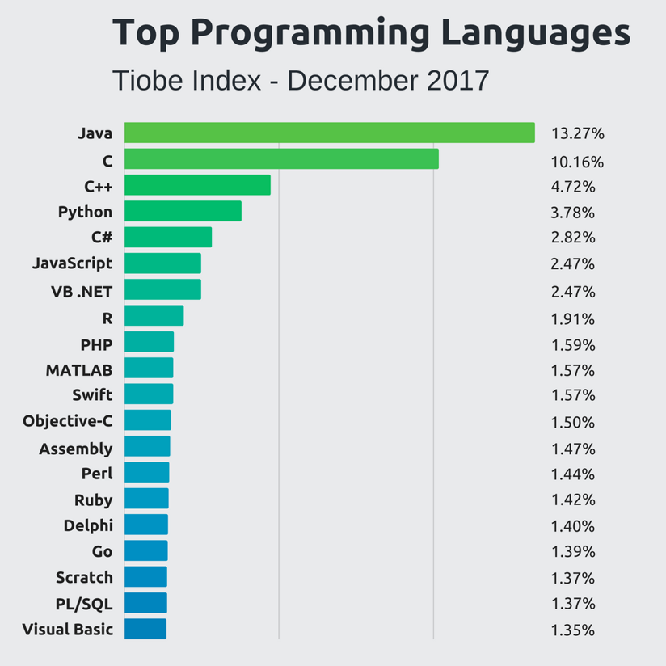
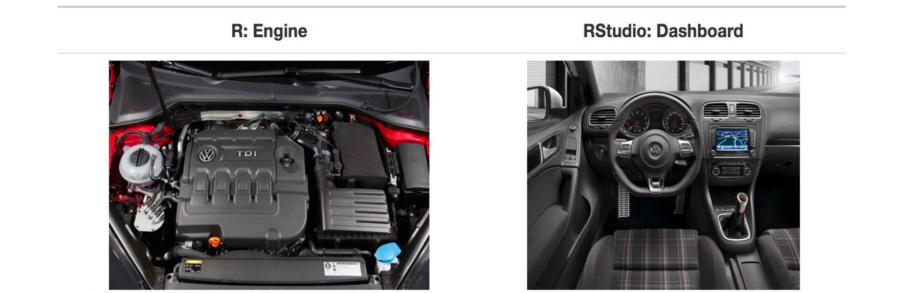
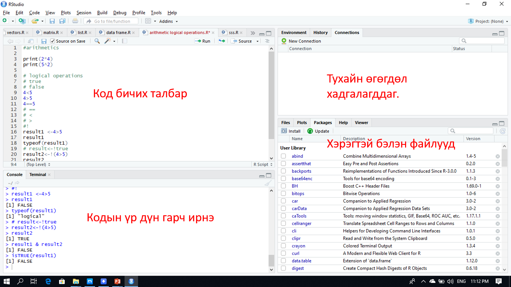
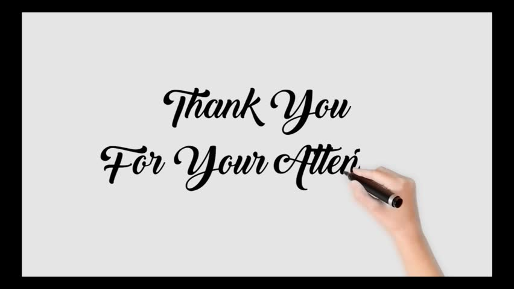

```{r setup, include=FALSE}
knitr::opts_chunk$set(echo = FALSE)
```

## WHO AM I {.columns-2 .smaller }

```{r, out.width = "500px"}

```


* <span style="color:black"> 2008-2012 БАКАЛАВР, МУИС-ЭЗС, ЭДИЙН ЗАСГИЙН ОНОЛ</span>
* <span style="color:black">2015-2018 МАГИСТР, САКАРЯА, ЭКОНОМЕТРИКЧ ЭДИЙН ЗАСАГЧ</span>
* <span style="color:black">ГРАНДЛАЙН БДК, МАКРО ШИНЖЭЭЧ</span>
* <span style="color:black">ХАСБАНК, ЭУГ, ЭРСДЭЛИЙН ШИНЖЭЭЧ</span>
* <span style="color:red">ГОЛОМТ БАНК, ЭУГ, МАКРО ШИНЖЭЭЧ</span> 
* <span style="color:red">МБХОЛБООНЫ СУДЛААЧДЫН ЗӨВЛӨЛИЙН ТЭРГҮҮН</span>
* <span style="color:red">IKON.MN – НИЙТЛЭЛЧ</span> 
* <span style="color:red">“ЭДИЙН ЗАСАГЧ”, “ЭКОНОМЕТРИК СУДАЛЦГААЯ” АДМИН</span> 


## WHO AM I 

```{r, out.width = "1000px"}

```

## Яагаад бид програмын хэл сурах хэрэгтэй вэ?

<div class="columns-2">

```{r, out.width = "500px"}

```

* Хөгжингүй орнуудаас хөгжиж буй орнууд руу ажилчид шилжинэ.

* Хэрвээ мэргэжилдээ ямар нэгэн диверсифкаци хийхгүй бол машин таныг орлох болно.
</div>

## Бид програмын хэл сурвал ямар давуу талтай болох вэ? {.smaller}

<div class="columns-2">

```{r, out.width = "500px"}

```


- Гартаа та хоёр том зэвсэгтэй болно.
- цалингийн хувьд хүссэн цалингаараа ажиллаж чадна.
- одоогийн дата аналистууд бидний салбарыг нарийн ойлгодоггүй.
- ирээдүйд бий болох ажлын байрны хувьд тэсч үлдэх боломжтой.
- одоогоор ирээдүйд ч энэ зүйлс тренд болсоор байна.

</div>

## Top programming language {.smaller}

<div class="columns-2">

```{r, out.width = "500px"}

```


```{r,echo=FALSE,warning=FALSE,message=FALSE,results='asis'}
pro<-c("Python","JavaScript","Java","R","Swift","Golana","C#","C++","SCALA","kotlin")
Salary<-c("166,379","110,000","97,000","91,470","81,000","120,000","78,000","116,551","117,369","131,250")
table1<-data.frame(pro,Salary)

colnames(table1)<-c("Program names","Salary")
rownames(table1)<-c("1","2","3","4","5","6","7","8","9","10")

library(tidyverse)

knitr::kable(table1)

```


</div>


## WHY IS R Studio

<div class="columns-2">

```{r, out.width = "400px"}

```


Ажлын байр болон компани

- Data analyst
- Data scientist
- Financial analyst
- Quantitative analyst


**91,470$ буюу 240 сая ₮**

</div>

## What is r studio


<div class="columns-2">
R хэл нь C++ бичигдсэн.

* статистик тооцоолол 
* өгөгдлийн шинжилгээ
* Эконометрикийн шинжилгээ
* Тоон шинжилгээ

R хэл нь өгөгдлийн шинжилгээнд (бас machine learning) хамгийн өргөн ашиглагддаг хэл.  


IDE-с гаргасан үнэгүй, нээлттэй шинжилгээний программ юм.


| Онцлог |  Ашиглалт|
|:-------------|:-------|
|- Статистик болон дата анализ-д нийтлэг ашигладаг|- Эконометрик загвар, өгөгдлийн шинжилгээ хийх санхүүгийн салбар|
|- Нээлттэй, үнэгүй source| - Телекомын салбар|
|- Ашиглахад асар их нөөц бололцоотой | - Менежмент   
|                                       | - Биологийн салбар|


## R & R studio

```{r, out.width = "1000px"}

```


## R studio installing 

https://www.r-project.org/

Эхлээд R –г суулгах шаардлагатай. Харин дараа нь Rstudio суулгах хэрэгтэй.

https://www.rstudio.com/products/rstudio/download/

Дээрх линкээр орж Windows, Mac, Ubuntu зэрэг аль үйлдлийн систем хэрэглэж байна. Түүнээсээ хамааран сонгох хэрэгтэй. 

Суулгасны дараа цэснүүдтэй танилцах нь 


## Ажлын цонхтой танилцах


<div class="centered">
```{r, out.width = "900px"}

```

</div>

## Анхаарал хандуулсан явдалд баярлалаа {data-background=bgc.jpg data-background-size=cover}

<div class="centered">

</div>