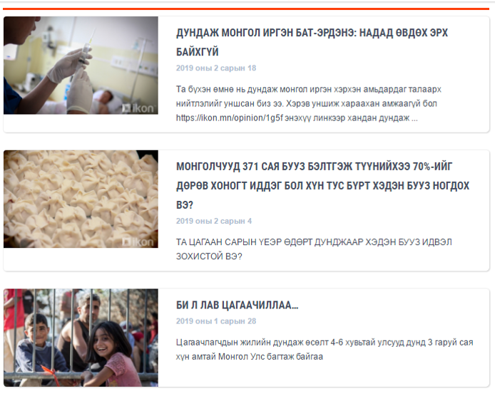
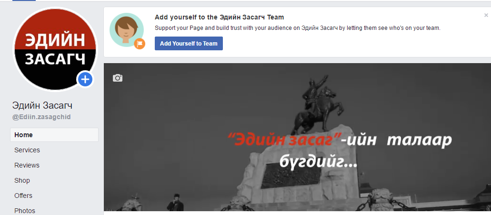
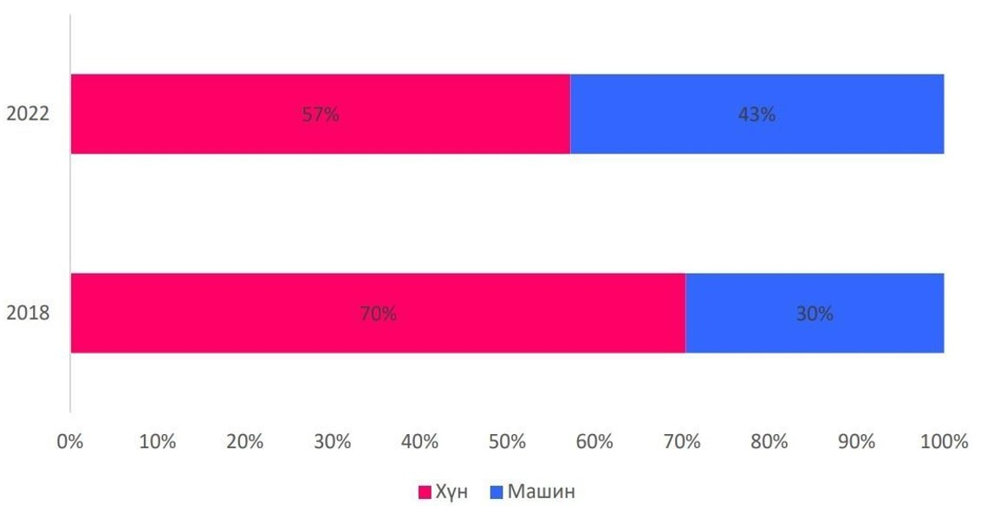
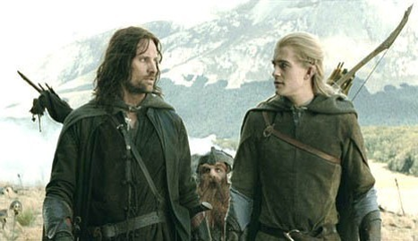
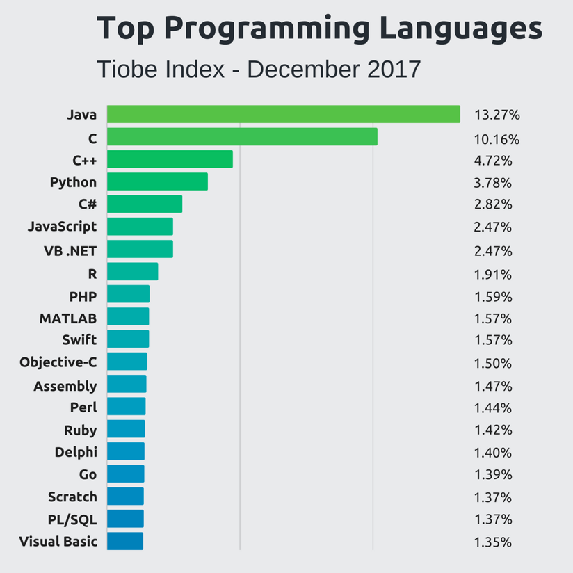
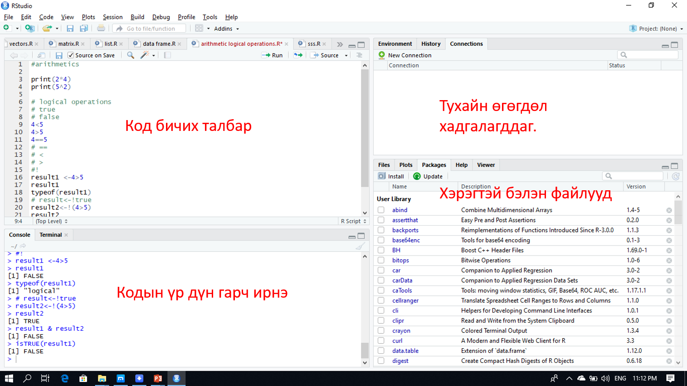
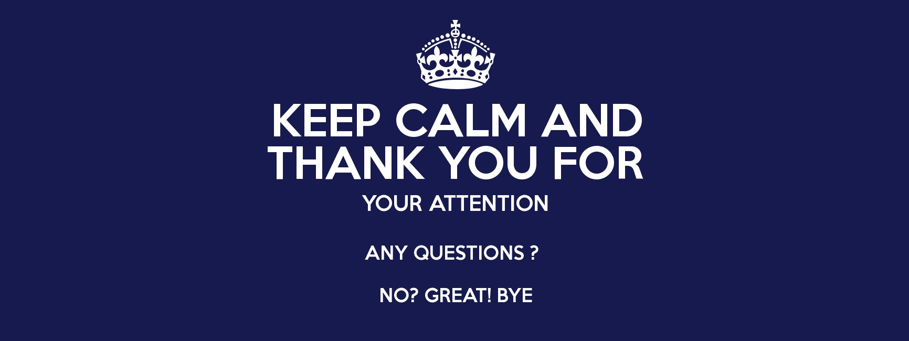

```{R, setup, include = F}

knitr::opts_chunk$set(echo = FALSE)
options(htmltools.dir.version = FALSE)
library(pacman)
p_load(
  broom, here, tidyverse,  latex2exp, ggplot2, ggthemes, viridis, extrafont, gridExtra,
  kableExtra,
  data.table,
  dplyr,
  lubridate,
  magrittr, knitr, parallel
)
# Define pink color
red_pink <- "#e64173"
turquoise <- "#20B2AA"
grey_light <- "grey70"
grey_mid <- "grey50"
grey_dark <- "grey20"
# Dark slate grey: #e64173
# Knitr options
opts_chunk$set(
  comment = "#>",
  fig.align = "center",
  fig.height = 7,
  fig.width = 10.5,
  warning = F,
  message = F
)
opts_chunk$set(dev = "svg")
options(device = function(file, width, height) {
  svg(tempfile(), width = width, height = height)
})
# A blank theme for ggplot
theme_empty <- theme_bw() + theme(
  line = element_blank(),
  rect = element_blank(),
  strip.text = element_blank(),
  axis.text = element_blank(),
  plot.title = element_blank(),
  axis.title = element_blank(),
  plot.margin = structure(c(0, 0, -0.5, -1), unit = "lines", valid.unit = 3L, class = "unit"),
  legend.position = "none"
)
theme_simple <- theme_bw() + theme(
  line = element_blank(),
  panel.grid = element_blank(),
  rect = element_blank(),
  strip.text = element_blank(),
  axis.text.x = element_text(size = 18, family = "STIXGeneral"),
  axis.text.y = element_blank(),
  axis.ticks = element_blank(),
  plot.title = element_blank(),
  axis.title = element_blank(),
  # plot.margin = structure(c(0, 0, -1, -1), unit = "lines", valid.unit = 3L, class = "unit"),
  legend.position = "none"
)
theme_axes_math <- theme_void() + theme(
  text = element_text(family = "MathJax_Math"),
  axis.title = element_text(size = 22),
  axis.title.x = element_text(hjust = .95, margin = margin(0.15, 0, 0, 0, unit = "lines")),
  axis.title.y = element_text(vjust = .95, margin = margin(0, 0.15, 0, 0, unit = "lines")),
  axis.line = element_line(
    color = "grey70",
    size = 0.25,
    arrow = arrow(angle = 30, length = unit(0.15, "inches")
  )),
  plot.margin = structure(c(1, 0, 1, 0), unit = "lines", valid.unit = 3L, class = "unit"),
  legend.position = "none"
)
theme_axes_serif <- theme_void() + theme(
  text = element_text(family = "MathJax_Main"),
  axis.title = element_text(size = 22),
  axis.title.x = element_text(hjust = .95, margin = margin(0.15, 0, 0, 0, unit = "lines")),
  axis.title.y = element_text(vjust = .95, margin = margin(0, 0.15, 0, 0, unit = "lines")),
  axis.line = element_line(
    color = "grey70",
    size = 0.25,
    arrow = arrow(angle = 30, length = unit(0.15, "inches")
  )),
  plot.margin = structure(c(1, 0, 1, 0), unit = "lines", valid.unit = 3L, class = "unit"),
  legend.position = "none"
)
theme_axes <- theme_void() + theme(
  text = element_text(family = "Fira Sans Book"),
  axis.title = element_text(size = 18),
  axis.title.x = element_text(hjust = .95, margin = margin(0.15, 0, 0, 0, unit = "lines")),
  axis.title.y = element_text(vjust = .95, margin = margin(0, 0.15, 0, 0, unit = "lines")),
  axis.line = element_line(
    color = grey_light,
    size = 0.25,
    arrow = arrow(angle = 30, length = unit(0.15, "inches")
  )),
  plot.margin = structure(c(1, 0, 1, 0), unit = "lines", valid.unit = 3L, class = "unit"),
  legend.position = "none"
)
theme_set(theme_gray(base_size = 20))
```

# WHO AM I 

.pull-left[ 
- <small>2008-2012 БАКАЛАВР, МУИС-ЭЗС, ЭДИЙН ЗАСГИЙН ОНОЛ</small>
- <small>2015-2018 МАГИСТР, САКАРЯА, ЭКОНОМЕТРИКЧ ЭДИЙН ЗАСАГЧ</small>
- <small>ГРАНДЛАЙН БДК, МАКРО ШИНЖЭЭЧ</small>
- <small>ХАСБАНК, ЭУГ, ЭРСДЭЛИЙН ШИНЖЭЭЧ</small>
- <small>ГОЛОМТ БАНК, ЭУГ, МАКРО ШИНЖЭЭЧ</small>
- <small>МБХОЛБООНЫ СУДЛААЧДЫН ЗӨВЛӨЛИЙН ТЭРГҮҮН</small>
- <small>IKON.MN – НИЙТЛЭЛЧ</small>
- <small>“ЭДИЙН ЗАСАГЧ”, “ЭКОНОМЕТРИК СУДАЛЦГААЯ” АДМИН</small>
]

.pull-right[

]

---

# WHO AM I

.center[]

---

# Яагаад бид програмын хэл сурах хэрэгтэй вэ?

.pull-left[
  .center[]]
.pull-right[
* Хөгжингүй орнуудаас хөгжиж буй орнууд руу ажилчид шилжинэ.
* Хэрвээ мэргэжилдээ ямар нэгэн диверсифкаци хийхгүй бол машин таныг орлох болно.
]

---

# Бид програмын хэл сурвал ямар давуу талтай болох вэ? 

.pull-left[]

.pull-right[
- Гартаа та хоёр том зэвсэгтэй болно.
- цалингийн хувьд хүссэн цалингаараа ажиллаж чадна.
- одоогийн дата аналистууд бидний салбарыг нарийн ойлгодоггүй.
- ирээдүйд бий болох ажлын байрны хувьд тэсч үлдэх боломжтой.
- одоогоор ирээдүйд ч энэ зүйлс тренд болсоор байна.
]

---
# Top programming language

.pull-left[]
.pull-right[
```{r,echo=FALSE,warning=FALSE,message=FALSE,results='asis'}
pro<-c("Python","JavaScript","Java","R","Swift","Golana","C#","C++","SCALA","kotlin")
Salary<-c("166,379","110,000","97,000","91,470","81,000","120,000","78,000","116,551","117,369","131,250")
table1<-data.frame(pro,Salary)

colnames(table1)<-c("Program names","Salary")
rownames(table1)<-c("1","2","3","4","5","6","7","8","9","10")

library(tidyverse)

knitr::kable(table1)

```
]

---

# WHY IS R Studio

.pull-left[
]

.pull-right[
Ажлын байр болон компани

- Data analyst
- Data scientist
- Financial analyst
- Quantitative analyst

**91,470$ буюу 240 сая ₮**
]

---
# What is r studio


.pull-left[
R хэл нь C++ бичигдсэн.

* статистик тооцоолол 
* өгөгдлийн шинжилгээ
* Эконометрикийн шинжилгээ
* Тоон шинжилгээ

R хэл нь өгөгдлийн шинжилгээнд (бас machine learning) хамгийн өргөн ашиглагддаг хэл.  


IDE-с гаргасан үнэгүй, нээлттэй шинжилгээний программ юм.
]

--

| Онцлог |  Ашиглалт|
|:------------|:-------|
|- Статистик болон дата анализ-д нийтлэг ашигладаг|- Эконометрик загвар, өгөгдлийн шинжилгээ хийх санхүүгийн салбар|
|- Нээлттэй, үнэгүй source| - Телекомын салбар|
|- Ашиглахад асар их нөөц бололцоотой | - Менежмент   
|                                       | - Биологийн салбар|


---
# R & R studio

https://www.r-project.org/

Эхлээд R –г суулгах шаардлагатай. Харин дараа нь Rstudio суулгах хэрэгтэй.

https://www.rstudio.com/products/rstudio/download/

Дээрх линкээр орж Windows, Mac, Ubuntu зэрэг аль үйлдлийн систем хэрэглэж байна. Түүнээсээ хамааран сонгох хэрэгтэй. 

Суулгасны дараа цэснүүдтэй танилцах нь 

---
# Ажлын цонхтой танилцах



---
class: inverse,center,middle
# Анхаарал хандуулсан явдалд баярлалаа 

.center[]


