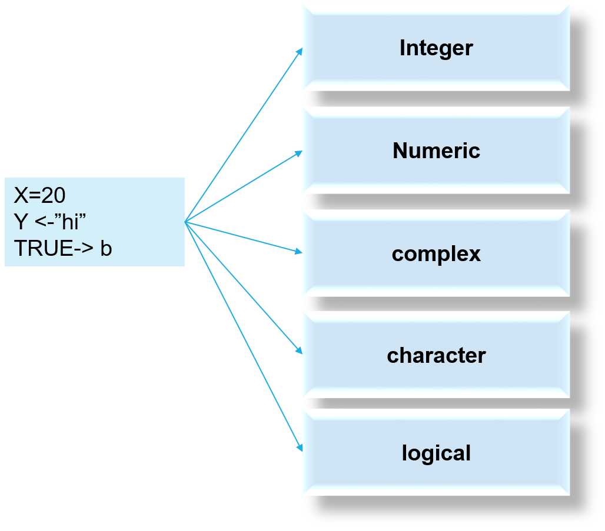
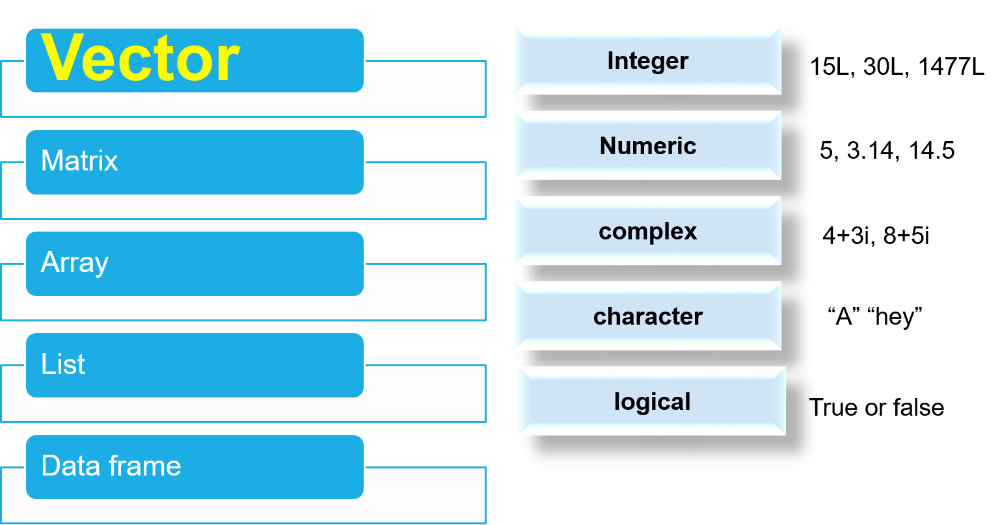
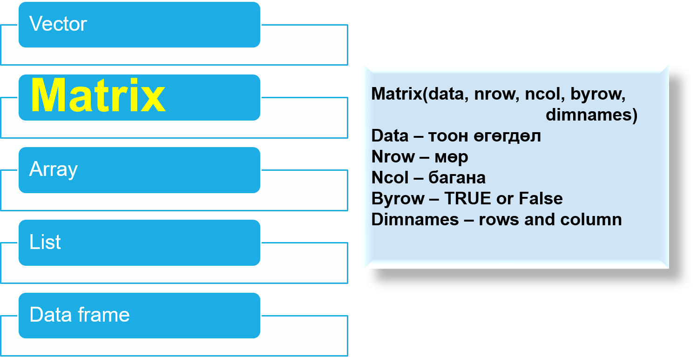
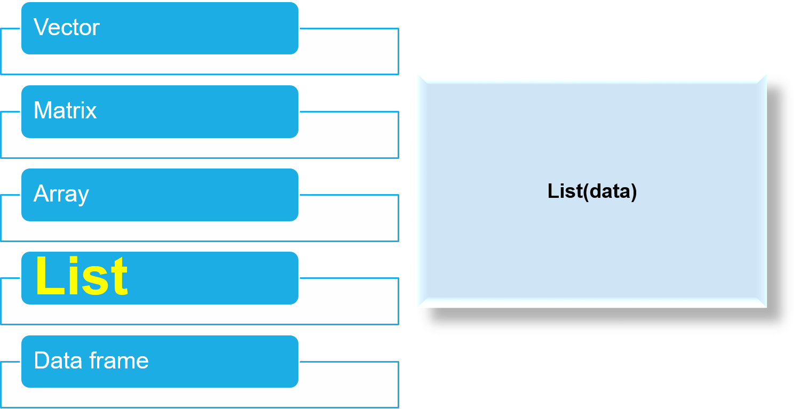
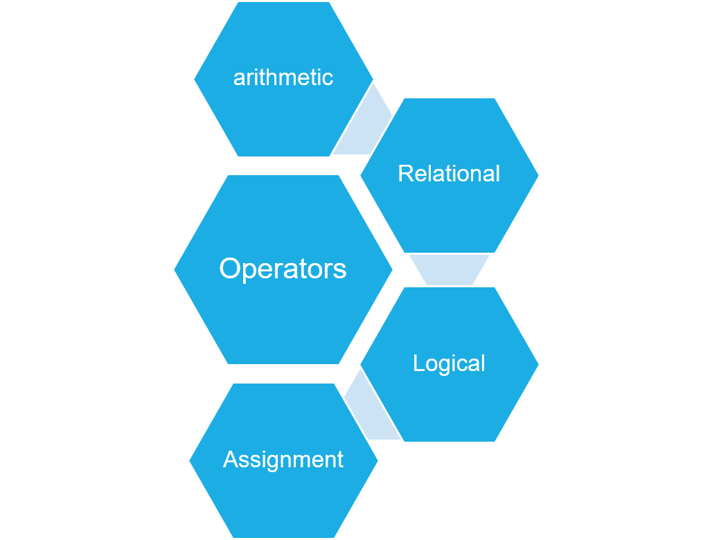
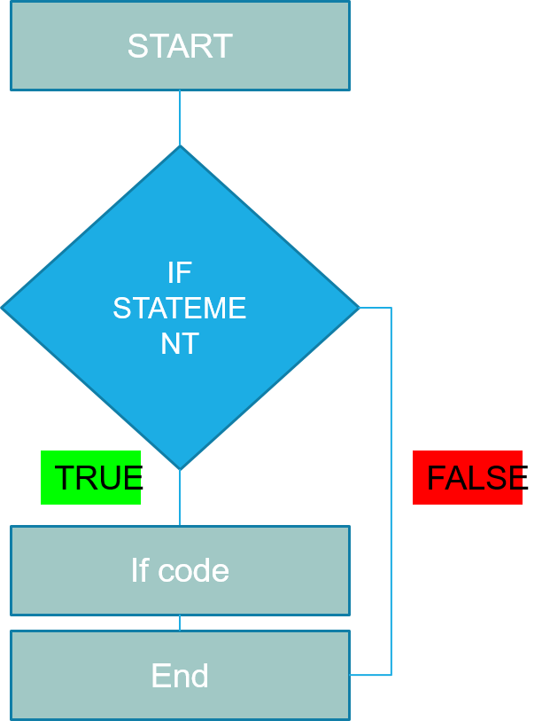
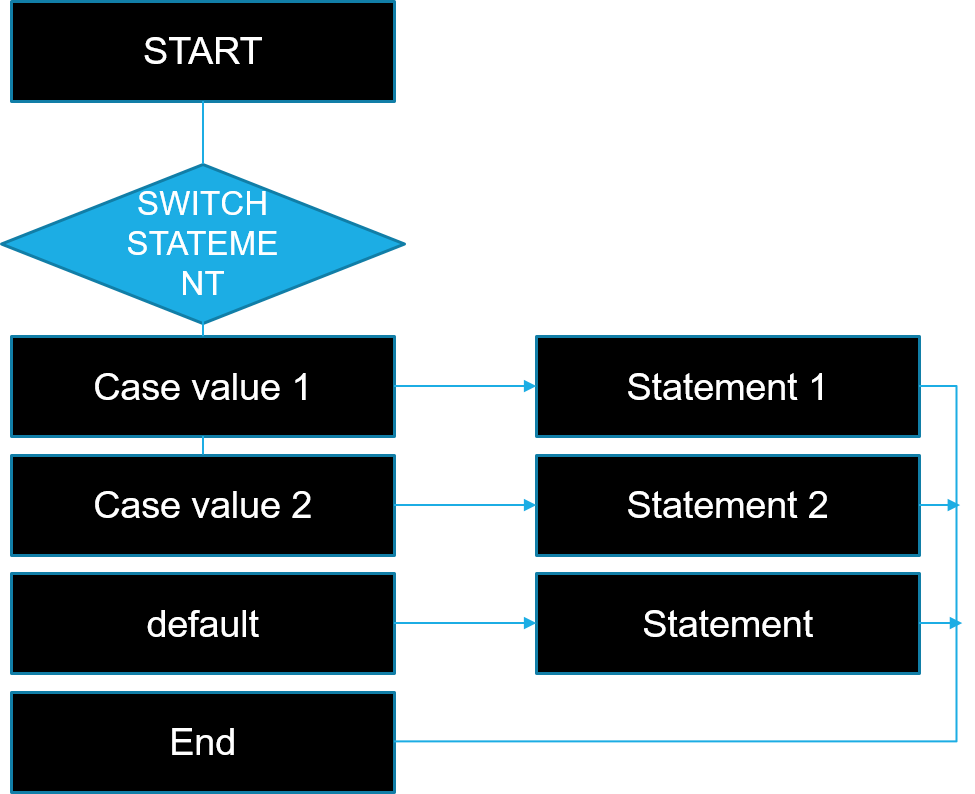
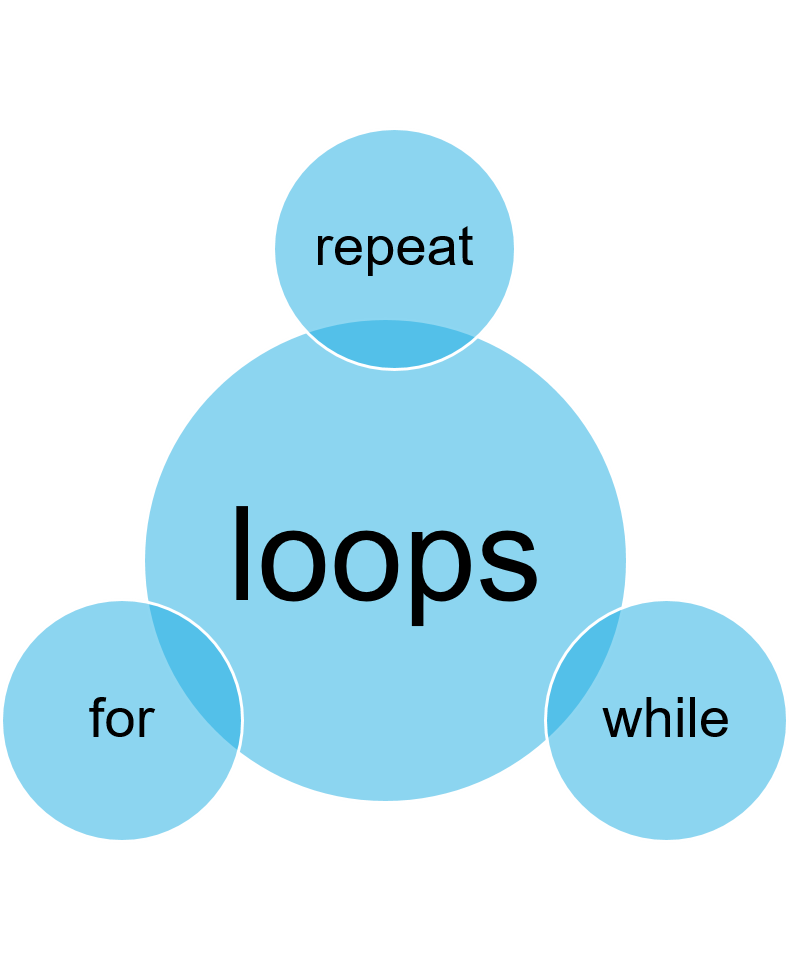

# R basic агуулга

- Variables – хувьсагч 
- Data types- тоон өгөгдлийн төрлүүд 
- Operators - үйлдэл
- Conditional statements – нөхцөлт
- Loops
- Strings
- Functions 

---
class: inverse, center,middle

# Variables
---
class: middle
# Variables

.pull-left[
]

.pull-right[
```{r,warning=FALSE,error=FALSE}
x<-2L
typeof(x)
y<-2.8
typeof(y)
z<-2.8+2i
typeof(z)
a<-"h"
typeof(a)
q1<-T
typeof(q1)
```
]

---
class: inverse, center, middle

# Data types

---

# Data types


---
# Vector

.pull-left[
```{r}
myfirstvector<- c(2,3,4,5,4)
myfirstvector
is.integer(myfirstvector)
is.double(myfirstvector)
```
]

--
.pull-right[
```{r}
is.numeric(myfirstvector)
is.character(myfirstvector)
class(myfirstvector)
```
]

---
# Matrix


---
# Matrix


```{r}
mydata<- 1:20
mydata
A<-matrix(mydata, 4, 5)
A
A[3,4]
```

---
# Matrix


.pull-left[
```{r}
B<-matrix(mydata,4,5,byrow = TRUE)
B
B[3,5]
```
]

--

.pull-right[
```{r}
#Example of setting row and column names
mrx <- matrix(c(1,2,3, 11,12,13), 
              nrow = 2, ncol = 3, 
              byrow = TRUE,
               dimnames = list(
                 c("row1", "row2"),
                 c("C.1", "C.2", 
                   "C.3")))
mrx

```
]

---
# List



---
# List

```{r}
mydata<- 1:20
mydata
A<-matrix(mydata, 4, 5)
A
```

---
# List

.pull-left[
```{r}
mydata2<-1:30
B<-matrix(mydata2, 2,5)
B
```
]

--

.pull-rigth[
```{r}
mylist=list(A,B)
mylist
```
]


---
# Dataframe

.pull-left[
```{r}
nomer=c(1:4)
nomer
NER=c("damba","anu","bat","dorj")
NER
alim=c(1,4,5,6)
alim
```
]

--

.pull-right[
```{r}
data.frame(nomer,NER, alim)

data.frame(cars)
```
]

---
class: inverse, center, middle

# Operators

---
# Operators

.pull-left[

- Арифметикийн ерөнхий үйлдэл : $a+b$, $a-b$, $a*b$, $a/b$
- Тэнцэтэл бус : $a<b$, $a>b$, $a=b$
- Логик : a&b, $a!b$, 
- For болон If loop
]

.pull-right[
```{r}
#CODE
# arithmetics
a<-10
b<-12
c<-a+b

bat1<-15
bat2<-16

answer<-sqrt(bat2)
answer

print(2*4)

```

]
---

# Operators

.pull-left[
```{r}
# Relational operations

4<5
4>5
4==5
result1 <-4>5
result1
```
]

.pull-right[
```{r}
#logical operators
# result<-!true
result2<-!(4>5)
result2
result1 & result2
isTRUE(result1)
```
]

---
class: inverse, center, middle
# Conditional statements

---

# IF STATEMENT

.pull-left[]
.pull-right[
```{r}
VAR1=25
VAR2=35

if((VAR1+VAR2)>100){
  print("niilber n 100s ih")
} else if((VAR1+VAR2)>75){
  print("niilber n 75s ih")
} else if((VAR1+VAR2)>65){
  print("niilber n 65s ih")
} else if((VAR1+VAR2)>55){
  print("niilber n 55s ih")
}

```

]

---
# IF STATEMENT

```{r}
# if statement
x<-rnorm(1)
if(x>1){
  answer<-"greater than 1"
} else if (x>= -1){
  answer<-"between -1 and 1"
} else { 
  answer<-"less than -1" 
}
y<-rnorm(1)
if(y<0){
print("y is negative number")
} else {
print("y is either positive")
}
```

---
# SWITCH STATEMENT

.pull-left[

]

.pull-right[
```{r}
switch(4,
         "1"=print("dawaa"),
         "2"=print("myagmar"),
         "3"=print("lhagwa"),
         "4"=print("purew"),
         "5"=print("baasan"),
         "6"=print("byamba"),
         "7"=print("nyam")
)
```

]

---
class: inverse, center, middle
# Loops

---

# Loops - Group of Statements  

.pull-left[

]

.pull-rigth[
```{r,eval=FALSE}
# While and For Loop
while(TRUE){
  print("hello")
}
while(FALSE){
print("hello")
}

x<-1
while(x<25){
  print(x)
  x<-x+1
}

for(i in 1:3){
print("hello")
}

for(i in 1:5) print(1:i)

```

```
]
---

# Loops

.pull-left[
```{r}
#repeat
x=1
repeat{
  x<-x+6
  print(x)
  if(x>32){
    break
    }
}
```
]

.pull-right[
```{r}
x=2
repeat{
  x<-x^2
  print(x)
  if(x>100){
    break
  }
}
```
]

---
# Some functions

```{r}
# sequence and replicate
seq(1,13) # same 1:13
seq(1,13,3)

rep(5,10)
rep(5,20,5)
```

---
class: inverse, center, middle
#Анхаарал хандуулсан явдалд баярлалаа 

.center[]